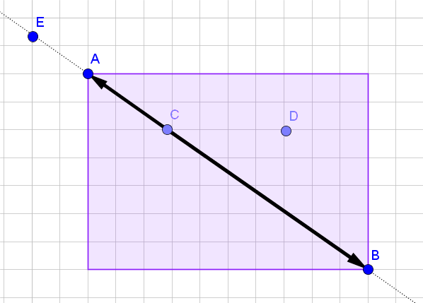
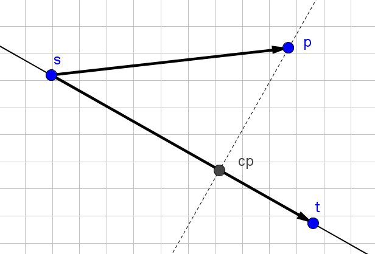
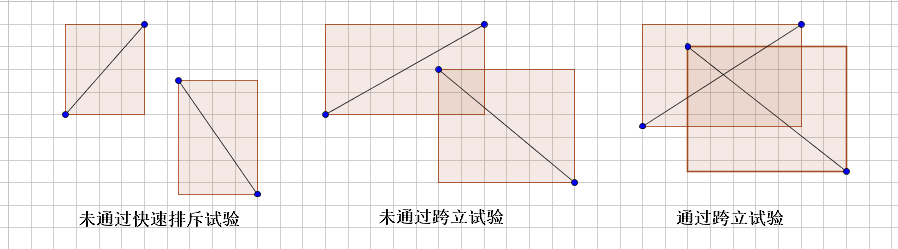

# 线段

## 直线与线段的表示方法

我们可以用一条线段的两个端点来表示一条线段。直线的表示有两种方式，一种方式是使用二元一次方程$$y=kx+b$$来表示，另一种是用直线上任意一条长度不为零的线段来表示。由于使用方程表示接近垂直于某坐标轴的直线时容易产生精度误差，所以我们通常使用直线上的某条线段来表示直线。

```cpp
struct Sg {
	Pt s, t;
	Sg() { }
	Sg(Pt s, Pt t) : s(s), t(t) { }
	Sg(double a, double b, double c, double d) : s(a, b), t(c, d) { }
};
```

## 点在线段上的判断

判断点$$C$$在线段$$AB$$上的两条依据：

1. $$\vec{CA}\cdot\vec{CB} = 0$$。
2. $$C$$在以$$AB$$为对角顶点的矩形内。

#### 示例代码

```cpp
bool PtOnSegment(Pt s, Pt t, Pt a) {
	return !det(a-s, a-t) && min(s.x, t.x) <= a.x && a.x <= max(s.x, t.x) &&
		min(s.y, t.y) <= a.y && a.y <= max(s.y, t.y);
}
```

### 另一种方法

判断点$$C$$在$$AB$$为对角线定点的矩形内较麻烦，可以直接判断$$\vec{CA}\cdot\vec{CB}$$的符号来判断$$C$$在直线$$AB$$上是否在$$AB$$之间。

<center></center>

#### 示例代码

```cpp
bool PtOnSegment(Pt p, Pt a, Pt b) {
    return !sgn(det(p-a, b-a)) && sgn(dot(p-a, p-b)) <= 0;
}
```

把上例代码中的`<=`改成`==`就能实现不含线段端点的点在线段上的判断。

## 点在直线上的判断

点在直线上的判断很简单只要把点在线段上的判断的步骤2去掉即可。

#### 示例代码

```cpp
bool PtOnLine(Pt p, Pt s, Pt t) {
	return !sgn(det(p-a, b-a));
}
```

## 求点到直线的投影

<center></center>

#### 示例代码

```cpp
Pt PtLineProj(Pt s, Pt t, Pt p) {
    double r = dot(p-s, t-s) / (t - s).norm();
    return s + (t - s) * r;
}
```

## 判断直线关系

直线有相交和平行两种关系，靠叉乘能简单判断。

```cpp
bool parallel(Pt a, Pt b, Pt s, Pt t) {
	return !sgn(det(a-b, s-t));
}
```

## 判断线段关系

线段有相交和不相交两种关系，通常按照以下步骤判断。

1. 快速排斥试验
2. 跨立试验

### 快速排斥试验

设以线段$$P_1P_2$$为对角线的矩形为$$R$$，设以线段$$Q_1Q_2$$为对角线的矩形为$$T$$，如果$$R$$和$$T$$不相交，显然两线段不会相交。

### 跨立试验

如果两线段相交，则两线段必然相互跨立对方。若$$P_1P_2$$跨立$$Q_1Q_2$$，则矢量$$\vec{Q_1P_1}$$和$$\vec{Q_1P_2}$$位于矢量$$\vec{Q_1Q_2}$$的两侧，即$$\vec{Q_1P_1} \times \vec{Q_1Q_2} \cdot \vec{Q_1Q_2} \times \vec{Q_1Q_2} < 0$$。上式可改写成$$\vec{Q_1P_1} \times \vec{Q_1Q_2} \cdot \vec{Q_1Q_2} \times \vec{Q_1P_2} > 0$$。当$$\vec{Q_1P_1} \times \vec{Q_1Q_2} = 0$$时，说明$$\vec{Q_1P_1}$$和$$\vec{Q_1Q_2}$$共线，但是因为已经通过快速排斥试验，所以$$P_1$$一定在线段$$Q_1Q_2$$上；同理，$$\vec{Q_1Q_2} \times \vec{Q_1P_2} = 0$$说明$$P_2$$一定在线段$$Q_1Q_2$$上。所以判断$$P_1P_2$$跨立$$Q_1Q_2$$的依据是：$$\vec{Q_1P_1} \times \vec{Q_1Q_2} \cdot \vec{Q_1Q_2} \ times vec{Q_1P_2} \geq 0$$。同理判断$$Q_1Q_2$$跨立$$P_1P_2$$的依据是：$$\vec{P_1Q_1} \times \vec{P_1P_2} \cdot \vec{P_1P_2} \times \vec{P_1Q_2} \geq 0$$。

<center></center>

## 求点到线段的距离

<!-- <center></center> -->

求线段$$ab$$到点p最短距离的方法为：

根据点$$p$$到的投影点的位置进行判断的方法：

1. 判断线段$$pa$$和$$ab$$所成的夹角，如果是钝角，那么$$|pa|$$是点到线段的最短距离。
2. 判断线段$$pb$$和$$ab$$所成的夹角，如果是钝角，那么$$|pb|$$是点到线段的最短距离。
3. 线段$$pa$$和线段$$pb$$与$$ab$$所成的夹角都不为钝角，那么点$$p$$到线段$$ab$$的距离是点$$p$$到直线$$ab$$的距离，这个距离可以用面积法直接算出来。

#### 示例代码

```cpp
double PtSegmentDist(Pt a, Pt b, Pt p) {
    if (sgn(dot(p-a, b-a)) <= 0) return (p-a).norm();
    if (sgn(dot(p-b, a-b)) <= 0) return (p-b).norm();
    return fabs(det(a-p, b-p)) / (a-b).norm();
}
```

