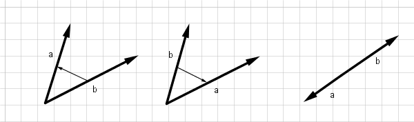

向量
====

## 简介

向量，又称矢量，是既有大小又有方向的量，向量的长度即向量的大小称为向量的模。在计算几何中，从$$A$$指向$$B$$的向量记作$$\vec{AB}$$。$$n$$维向量可以用$$n$$个实数来表示。向量的基本运算包括加减法、数乘、点积、叉积和混合积。使用向量这一个基本的数据结构，我们可以用向量表示点和更复杂的各种图形。

## 注意事项

我们一般用一个二维向量来表示点。注意，在有些计算几何相关的题目中，坐标是可以利用整形储存的。在做这样的题目时，坐标一定要用整形变量储存，否则精度上容易出错。具体的将点的坐标用整形变量储存可以需要使用一些技巧，比如计算中计算平方或将坐标扩大二倍等方式。

```cpp
// Pt是Point的缩写
struct Pt {
    double x, y;
    Pt() { }
    Pt(double x, double y) : x(x), y(y) { }
};

double norm(Pt p) { return sqrt(p.x*p.x + p.y*p.y); }
void print(Pt p) { printf("(%f, %f)", p.x, p.y); }
```

## 基本计算

### 加减法

$$\vec{a} \pm \vec{b} = (a_x \pm b_x, a_y \pm b_y)$$

向量的加减法遵从平行四边形法则和三角形法则。

##### 示例代码

```cpp
Pt operator - (Pt a, Pt b) { return Pt(a.x - b.x, a.y - b.y); }
Pt operator + (Pt a, Pt b) { return Pt(a.x + b.x, a.y + b.y); }
```

### 长度

向量$$\vec{a}=(a_x, a_y)$$的长度是$$\sqrt{a_x^2+a_y^2}$$。

##### 示例代码

```cpp
double len(Pt p) { return sqrt(sqr(p.x)+sqr(p.y)); }
```

### 数乘

$$a\vec{b} = (a b_x, a b_y)$$。

向量的数乘是一个向量和实数的运算。$$a$$如果是零，那么结果是一个零向量，如果$$a$$是一个负数，那么结果向量会改变方向。

##### 示例代码

```cpp
Pt operator * (double A, Pt p) { return Pt(p.x*A, p.y*A); }
Pt operator * (Pt p, double A) { return Pt(p.x*A, p.y*A); }
```

### 点积

又称内积。

$$\vec{a} \cdot \vec{b} = a_xb_x + a_yb_y = |\vec{a}||\vec{b}|\cos\theta$$，其中$$\theta$$是$$\vec{a}$$与$$\vec{b}$$的夹角。

#### 应用

点积可以用来计算两向量的夹角。

$$
\cos\beta = \frac{\vec{a} \cdot \vec{b}}{|\vec{a}||\vec{b}|}
$$

##### 示例代码

```cpp
double dot(Pt a, Pt b) { return a.x * b.x + a.y * b.y; }
```

### 叉积

叉积又称外积。叉积运算得到的是一个向量，它的大小是$$\vec{a}$$和$$\vec{b}$$所构成的平行四边形的面积，方向与$$\vec{a}$$和$$\vec{b}$$所在平面垂直，$$\vec{a}$$、$$\vec{b}$$与$$\vec{a} \times \vec{b}$$成右手系。

设两向量$$\vec{a}=(a_x, a_y)$$与$$\vec{b}=(b_x, b_y)$$，它们在二维平面上的的叉积为：

$$\vec{a} \times \vec{b} = a_xb_y - a_yb_x$$

##### 示例代码

```cpp
double det(Pt a, Pt b) { return a.x * b.y - a.y * b.x; }
```

#### 性质与应用

叉积拥有两个重要的性质——面积与方向。

两向量叉积得到新向量的长度为这两个所构成的平行四边形的面积，利用这个性质我们可以求三角形的面积。

两向量叉积能反映出两向量方向的信息。如果$$\vec{a} \times \vec{b}$$的符号为正，那么$$\vec{b}$$在$$\vec{a}$$的逆时针方向；如果符号为负，那么$$\vec{b}$$在$$\vec{a}$$的顺时针方向；如果结果为零的话，那么$$\vec{a}$$与$$\vec{b}$$共线。

<center></center>

| 计算结果             | $$b$$与$$a$$的方向       |
|----------------------|--------------------------|
| $$|b \times a| > 0$$ | $$a$$在$$b$$的逆时针方向 |
| $$|b \times a| = 0$$ | $$a$$与$$b$$共线         |
| $$|b \times a| < 0$$ | $$a$$在$$b$$的顺时针方向 |

## 模板代码

```cpp
Pt operator - (Pt a, Pt b) { return Pt(a.x - b.x, a.y - b.y); }
Pt operator + (Pt a, Pt b) { return Pt(a.x + b.x, a.y + b.y); }
Pt operator * (double A, Pt p) { return Pt(p.x*A, p.y*A); }
Pt operator * (Pt p, double A) { return Pt(p.x*A, p.y*A); }
Pt operator / (Pt p, double A) { return Pt(p.x/A, p.y/A); }
```

